# Machine Learning Prueba de Despliegue AWS - NLP

Nombre: Diego Fernando Cardona Pineda

correo: diegocp031293@gmail.com

# Introducción

Este repositorio, contiene una base de despliegue de MLOps, como fuente de datos para esta se utiliza el conjunto de datos *Consumer Complaint Dataset* que se encuentra en Kaggle (enlace directo: https://www.kaggle.com/datasets/namigabbasov/consumer-complaint-dataset?resource=download). Este set de datos contiene información bancaria de personas estadounidense, fue recolectada por *The Consumer Financial Protection Bureau* (CFPB), entre las variables que tiene se encuentran comentarios de los clientes sobre sus quejas o comentarios y asociados a estas una clasificación tentativa del tipo de queja o comentario al que se refiere. Por ejemplo, un comentario como el siguiente:

- *I sent a letter to the Credit Bureaus requesting to reinvestigate the disputed Accounts from my cred...*

Corresponde a la categoría de *Credit Reporting*. Las distintas categorías existentes son:

0. Credit Reporting.
1. Debt Collection.
2. Loans.
3. Credit Card Services.
4. Bank Accounts and Services.

En el dataset, se encuentran distintas variables que pueden ser de utilidad, pero para practicidad de la prueba nos enfocaremos en el siguiente tipo de modelo:

- Tenemos el conjunto de datos de entrenamiento, datos mencionados, que para cada tipo de comentario (variable X feature) nos va a asignar una categoría correspondiente (variable Y target).
- Entonces nuestro modelo al entrenarse con estos datos, va a poder predecir a qué tipo de categoría, entre las 5 ya mencionadas, corresponde el comentario.
- Este tipo de modelo es útil ya que se puede usar con la información de redes sociales o comentarios de servicio al cliente y ver preferencias, gustos, sentimientos, categorías, etc del cliente. De esta forma se le puede dar un mejor enfoque y tratamiento dentro de una entidad bancaria al cliente.

## Prueba de Modelo Desplegado

Antes de ver todas las consideraciones, es importante mostrar cómo acceder al modelo desplegado y funcionando.

Para poder probar el modelo, se ha desplegado un endpoint de acceso, el enlace a este es el siguiente:

http://nlp-nequi-mlops-env.eba-hr323mqz.us-east-2.elasticbeanstalk.com/docs

Este endpoint fue desarrollado con FastAPI y gracias a su forma documental, se puede tener una mirada previa a cómo utilizar el modelo desplegado. Este modelo fue desarrollado para poder recibir peticiones en batch o grupos de información y da una respuesta en tiempo real. Con este desarrollo, es sólo cuestión de hacer un desarrollo de frontend para ser comercializado.

La forma de utilizarlo es siguiendo los siguientes pasos:

1. Le aparecerá una pantalla como la siguiente donde deberá seleccionar la primer barra con la palabra POST en verde (el POST muestra que se hace una petición del tipo enviar información y recibir un resultado):

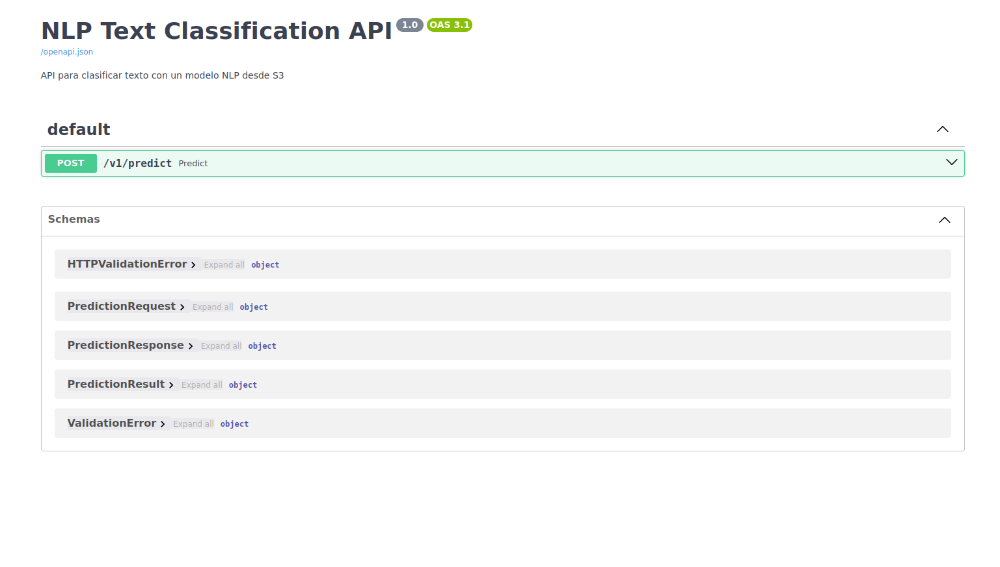

Al seleccionar esta opción, se le desplegará otra visual, en donde al lado derecho tiene un botón que dice *Try it out* debe presionarlo para poder ingresar una petición.

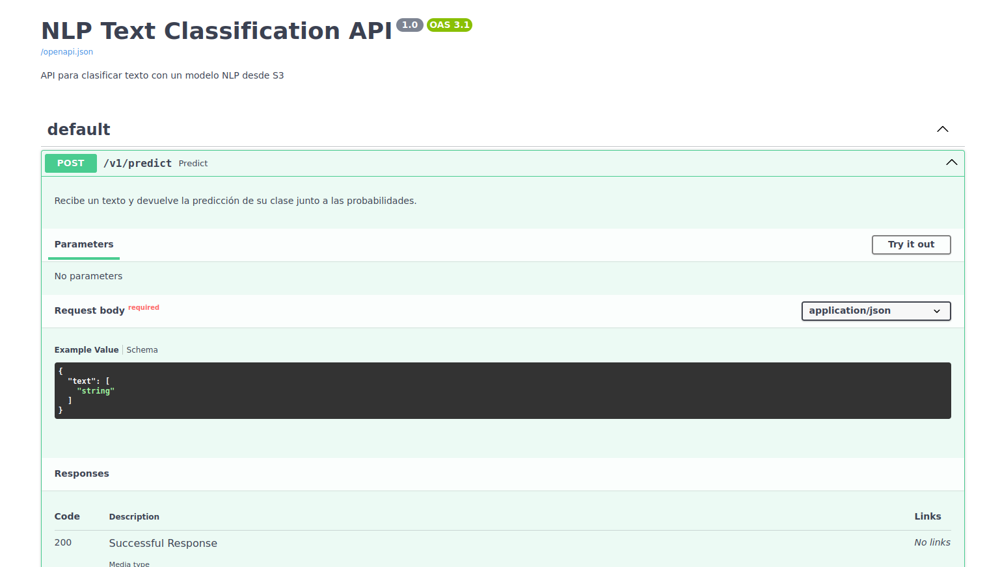

Edición

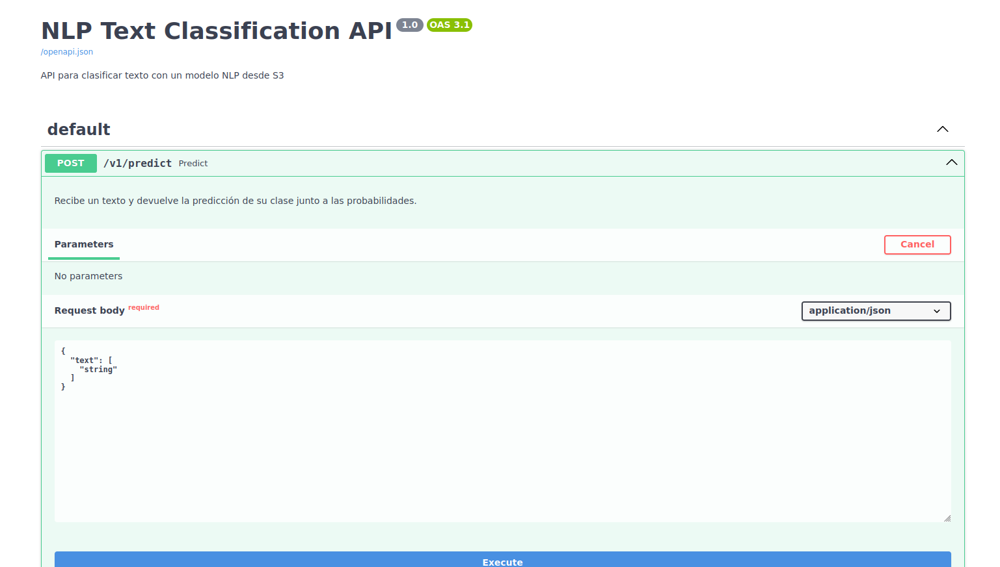

Ahora, podrá ingresar una serie de peticiones, por ejemplo imagine que necesita identificar una serie de quejas o comentarios de clientes, podrá detectar a qué categoría corresponden. Un ejemplo es ingresar lo siguiente:

`{
  "text": [
    "I have a problem with my credit report",
    "Can you help me with a credit card for my job?",
    "In the last year, I was working with one bank account instance of several accounts"
  ]
}`

Se verá algo como lo siguiente:

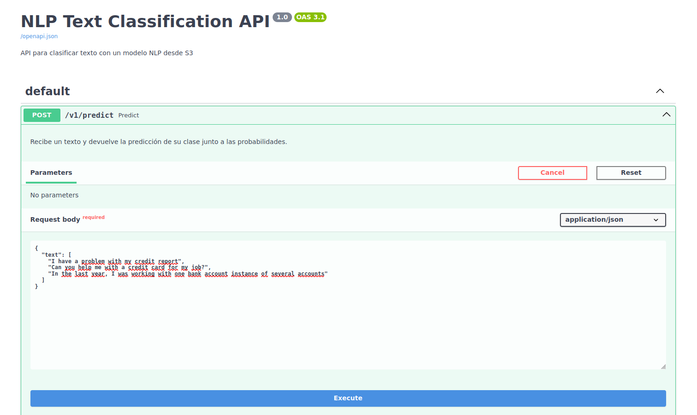

Ahora presione en el botón orizontal azul grande *Execute* y al bajar en la página podrá ver los resultados de la predicción:

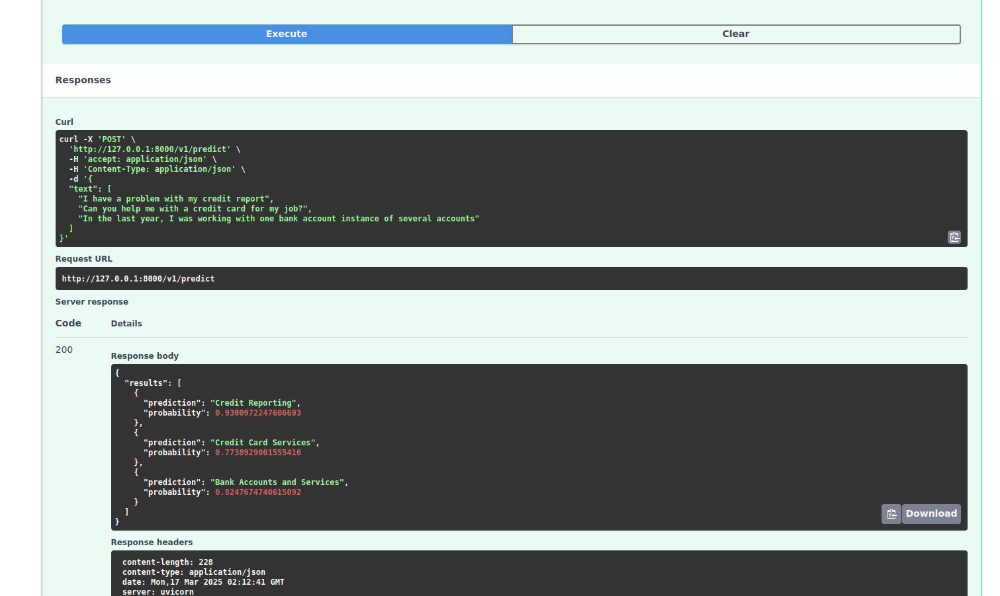

Las predicciones muestran a qué categoría corresponde la conversación y con qué cantidad de probabilidad se tiene certeza de esto.

Así como se tiene un despliegue del modelo en un endpoint, también esta calendarizado para que se ejecute el entrenamiento y predicciones cada cierta fecha (domingo en la tarde 15 horas utc), esto se puede ver en el archivo .github/workflow/ct.yml en *'0 15 * * 0'* que es la parte de la automatización.

De igual forma, hay un botón en los *Actions* del repositorio, esto ejecuta manualmente el proceso de entrenamiento.

Finalmente, se puede obtener una muestra en local del modelo descargando el archivo docker_model.zip, este debe ser implementado preferencialmente usando un sistema operativo amigable con comandos como Linux.

En este caso, se tiene el archivo descargable en utils/model_comprimido.zip, este archivo contiene la versión ejecutable en local al crear la imagen docker desde la terminal.

Para esto se debe descargar el archivo y extraer su contenido en una carpeta, luego desde la terminal de comandos, teniendo instalado docker (ver https://www.digitalocean.com/community/tutorials/how-to-install-and-use-docker-on-ubuntu-20-04-es), podemos correr lo siguiente parados en el contenido descargado:

`sudo docker build -t prueba-app .`

Para crear la imagen mediante el contenedor docker, luego que se instala podemos correr dicha imagen creada en el puerto 8000:

`sudo docker run -p 8000:8000 prueba-app`

Y finalmente si vamos a el explorador principal que usamos, ingresamos la dirección creada como 

`http://0.0.0.0:8000/docs`

Volveremos a visualizar lo ya mencionado de la página interactiva de documentación FastAPI.

# 1. Propuesta de arquitectura en la nube

Para desarrollar el proyecto, se optó por una arquitectura basada en nube de Azure Web Service (AWS), junto con la gestión del versionamiento en GitHub y la automatización de los diferentes pipelines con GitHub Actions.

A continuación se muestra la arquitectura en alto nivel:

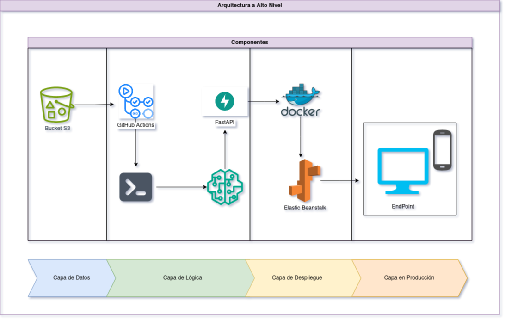

Antes de continuar hablando sobre las componentes, cabe mencionar la metodología utilizada, esta se puede entender en el siguiente flujo:

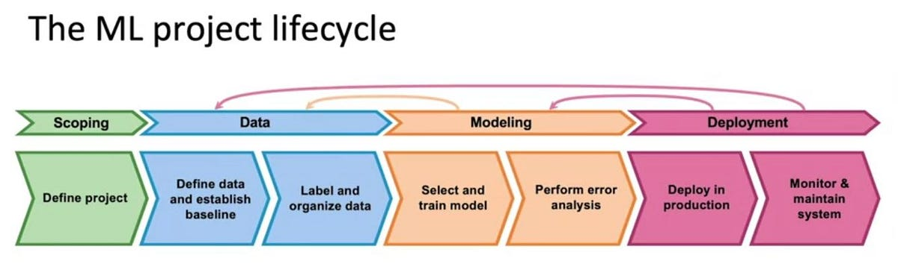

Esta propuesta de trabajo, empieza por entender el problema, para este caso nuestro objetivo fue el ya mencionado clasificador de categorías bancarias sobre las quejas de los clientes. En esta parte se hizo un análisis exploratorio de los datos y la primer parte experimental del modelamiento, esta se encuentra consignada en la carpeta notebooks.
En la primer etapa de experimentación, se hizo un análisis de la nulidad de los datos, tipos de datos, cantidad, comportamientos, en esta primer parte se observo que los principales temas abordados por los clientes bancarios son los temas de reportes crediticios,seguido de cobro de deudas. Esto nos muestra las tendencias de clientes y sus principales cuestionamientos a los que hay que revisar el por qué tantos comentarios (¿son buenos o malos? ¿debemos mejorar como entidad? ¿esto hace perder valor a otros productos ofrecidos?).

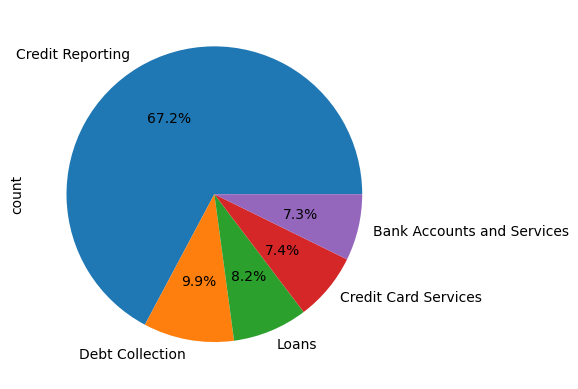

En la parte experimental, se hizo una reducción de los datos ya que la capacidad del equipo con que se cuenta es baja, también por cuestiones de tiempo se hicieron optimizaciones en los datos que se mencionarán más adelante. Originalmente la fuente de datos cuenta con aprox 2 millones de datos y se redujeron a 1 millon de registros.

Los datos originales vienen desde el 2011 hasta el 2024 y descartando la principal categoría de los temas mencionados por los clientes, vemos que hay una tendencia al crecimiento sobre los temas de cuentas bancarias y tarjetas de crédito, pero estas tienen un crecimiento exponencial y desbordado en 2023. Este periodo, coincide con el regreso a la normalidad pos-pandemia, ¿puede ser este un punto de inflexión? podríamos hacer una regresión con datos de casos de covid-19 por ejemplo, pero deberá ser minuciosa dado que correlación no implica causalidad como se sabe.

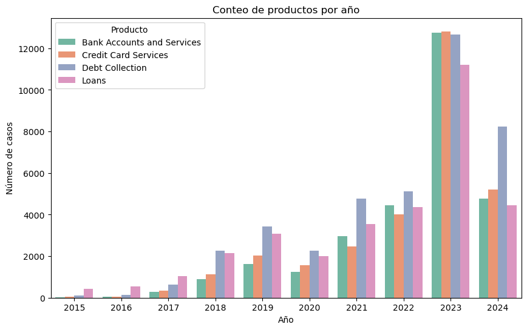

Entre los principales crecimientos, vemos que también puntea en 2023 el tema relacionado con cobro de deuda, este puede ser un buen indicio para responder algunas de las anteriores preguntas. Recordando que en epoca de pandemia las tasas de interés estuvieron en mínimos ehistóricos las personas pudieron haber sufrido por la subida de estas y la tentativa de recesión mundial.

Posterior al análisis hecho (análisis corto, puede ser más profundo pero nuestro interes es optimizar el tiempo de todos los pasos del proyecto y priorizar el despliegue), se plantea un modelo de clasificación utilizando el algoritmo de modelamiento LightGBM, este framework consta de un modelo gradiente con boost. El modelo crea una serie de árboles de decisión a partir de los datos suministrados y las categorías referenciadas, de esta forma aprende a decidir a qué categoría corresponde algún texto.

Para una correcta implementación del modelo, se implementó una encodización de las categorías, en vez de tener las 5 categorías ya mencionadas, se les cambia por valores numéricos enteros (0,1,2,3,4) para que el modelo los interprete mejor y sea más optimo.

## Escalabilidad

- Amazon S3 se utiliza como repositorio centralizado para almacenar grandes volúmenes de datos, modelos y artefactos. Su arquitectura distribuida permite manejar datasets de tamaño prácticamente ilimitado sin impactar el desempeño.
- Elastic Beanstalk, en combinación con Docker, permite desplegar de forma automática y sencilla la aplicación basada en FastAPI. La capacidad de autoescalado de Elastic Beanstalk garantiza que la infraestructura crezca o disminuya según la demanda del tráfico o la carga de trabajo de inferencia.
- FastAPI es un framework asíncrono y de alto rendimiento, ideal para manejar peticiones simultáneas y realizar inferencias en tiempo real de manera eficiente.
- El entrenamiento y la preparación de datos se realizan fuera del entorno de producción, cabe decir que la solución funciona tanto en bach como en tiempo real, el modelo se entrena cada domingo en la tarde y después se pueden hacer predicciones sobre datos almacenados. Además, el punto final (endpoint) creado, permite que se puedan obtener respuestas en el momento.

## Confiabilidad

- Elastic Beanstalk monitorea continuamente la salud de los entornos desplegados. Si un contenedor Docker falla, Elastic Beanstalk lo reinicia o escala nuevas instancias sin intervención manual.
- La persistencia de los datos y los modelos en S3 asegura que la información crítica no se pierda en caso de una interrupción del servicio o fallo del servidor.
- GitHub Actions se encarga de la automatización de los pipelines de CI/CD, asegurando que las nuevas versiones del modelo y el código se desplieguen de forma consistente, fiable y auditada.
- La separación clara de componentes (preprocesamiento, entrenamiento, despliegue) permite una fácil observabilidad, debugging y mantenimiento, lo que aumenta la confiabilidad del sistema global.

## Elección de los componentes para la preparación de datos, trabajos ETL, implementación de modelos y su papel en la arquitectura

### 1. **Data Preparation y ETL:**

- **Python (pandas / numpy):**
  - Procesamiento y limpieza de datos antes de su almacenamiento o consumo.
  - Transformaciones ligeras y manipulación de datasets.

- **S3:**
  - Se guarda el contenido de la información. Un paso faltante es la automatización de la carga desde kaggle o alguna fuente de datos, esto es posible con una lambda de AWS.
  - Permite almacenar datos estructurados, optimizando consultas y tiempos de respuesta.
  - Uso de esquemas particionados por país y ciudad para segmentar datos y mejorar el performance.
  - En el caso de este proyecto, se buscó hacer una organización tipo medalla, es decir que se buscan tener las capas bronze, silver y gold, en donde bronze tiene los datos mas crudos, silver los datos procesados y gold los datos para mostrar en reportes.

  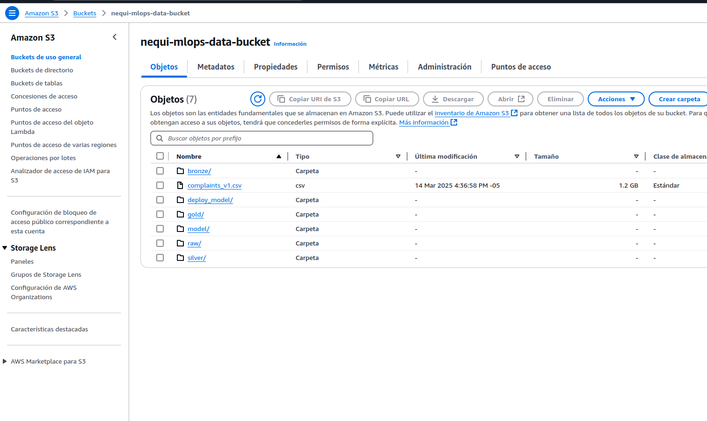

### 2. **Model Training e Implementación:**

- **scikit-learn /  LightGBM:**
  - Entrenamiento de modelos predictivos, en nuestro caso para predicciones de clasificación.
  - Experimentar con diferentes algoritmos.

- **MLflow:**
  - Seguimiento de experimentos, métricas de modelos y control de versiones.
  - Facilita la trazabilidad y comparación entre modelos.
  - Se guardó en S3 el seguimiento de mlflow que arrojó métricas y la mátriz de confusión.

- **Docker:**
  - Empaquetado de los modelos para garantizar consistencia entre entornos de desarrollo y producción.
  - Asegura que las dependencias del modelo se mantengan estables.

### 4. **Deployment y Monitoreo de Modelos:**

- **FastAPI:**
  - Creación de servicios REST para exponer las predicciones de los modelos.
  - Ligero y de alto rendimiento, ideal para APIs de predicciones en tiempo real.

---

## Pipelines de CI/CD y su Rol en el Proyecto

El pipeline del proyecto se fundamenta en los siguientes workflows de GitHub Actions:

- `ct.yml`:
  - Se ejecuta en los **push** a la rama `main`.
  - Hace todo el trabajo de preparar los datos trayéndolos desde el bucket de S3 (ETL) y al procesarlos entrena un nuevo modelo.

- `test.yml`:
  - Hace un test de conexión a S3 para validar que hay una correcta conexión, los test se pueden ampliar más adelante para hacer pruebas más robustas como de conexión de la api y otras validaciones.
  - Este también incluye pruebas de flake8, es decir que revisa el código y verifica que cumpla con los estándares de calidad de código.

- `ci_cd.yml`:
  - Se ejecuta automáticamente cuando termina el `test.yml`.
  - Hace toda la creación del nuevo contenedor que guarda el modelo y lo despliega en Elastic Beanstalk.

### **Resumen del flujo:**
1. Push a `main`/ `domingo 15 utc` → se ejecuta `ct.yml`.
2. `ct.yml` finaliza exitosamente → se ejecuta `test.yml` para pruebas de validación.
3. `test.yml` finaliza exitosamente → se ejecuta `ci_cd.yml` para hacer el despliegue en producción.

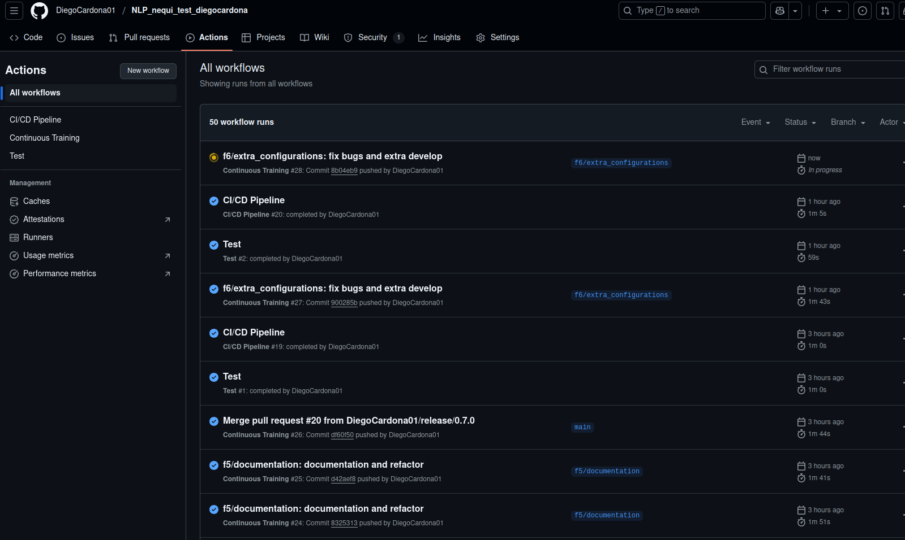

---

## Monitoreo y Observabilidad

El entorno desplegado en **Elastic Beanstalk** cuenta con las siguientes herramientas para monitoreo y logging:

- **CloudWatch Logs**: Recolección de logs de la aplicación y del entorno EC2.
- **Alarmas de CloudWatch**: Alertas configuradas para eventos críticos como fallos en el servicio, latencia elevada o errores HTTP 5xx.
- **Elastic Beanstalk Health Dashboard**: Visibilidad sobre el estado de las instancias y métricas básicas (CPU, memoria, latencia).
- **Prometheus + Grafana** (opcional en ambientes locales o de testing): Para monitoreo avanzado de métricas internas durante el desarrollo.

 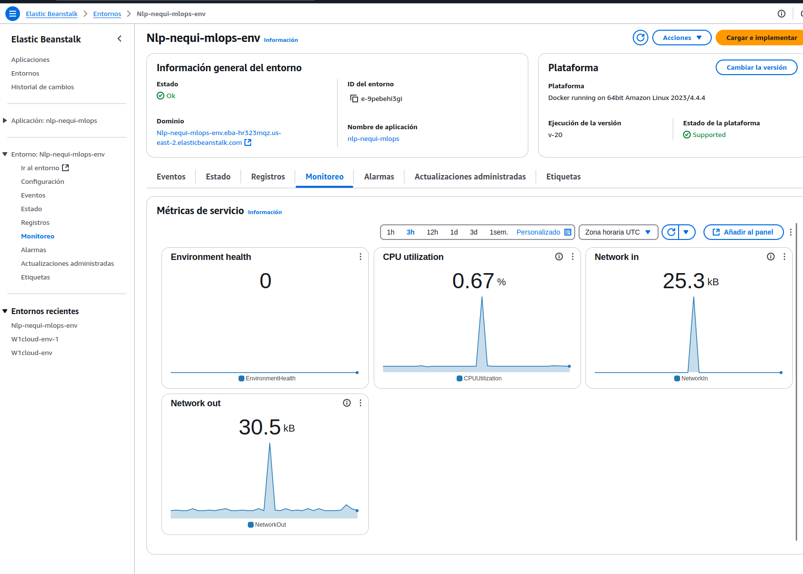

---

Con este resumen, terminamos la descripción del repositorio completo, quedan temas por mejorar como el crecimiento de los módulos para tener más funcionalidades que rescatar del modelo o distintas formas de acceso, con la estructura de carpetas propuesta y las tecnologías usadas es posible el escalamiento del repositorio.

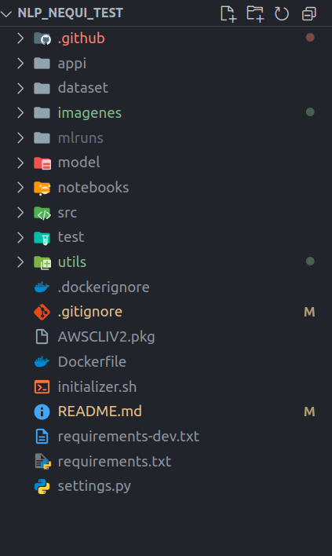

También, la metodología de control de versiones fue similar a la de git flow, en esta se tuvieron dos ramas principales:

- main: tiene el contenido actualizado del proyecto (producción).
- develop: es la rama de la que se parte para sacar nuevas funcionalidades, sirve como rama previa a producción por seguridad (producción main)
- fn features: las ramas features son ramas que se desprenden de develop y en estas se crean las nuevas funcionalidades. Estas existen con el fin de no perjudicar lo que hay en producción.

El flujo de trabajo fue el siguiente:

Se crea una rama feature desde develop → se hace el desarrollo correspondiente → se envia el push al repositorio → se hace merge con develop → si todo esta bien (se debería aprovar por otros) se saca un release desde develop release/0.0.0 su versión se puede ver en el archivo setting.py → se hace push del release y se mergea primero a main y luego a develop.

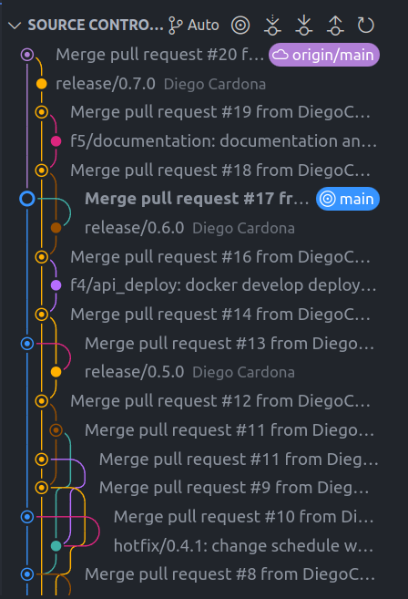

Si existe algún error urgente, que se tiene que sacar pronto de producción, se hace un hotfix: se saca una rama de main (actualizado), la rama se llama hotfix/#1.#2.#3 segun la versión que se tenga cambia el #3 y los demás se mantienen, se hacen los cambios y se mandan al remoto y se mergean primero a main y luego a develop

Para más comentarios o preguntas sobre este proyecto, comunicarse a diegocp031293@gmail.com
